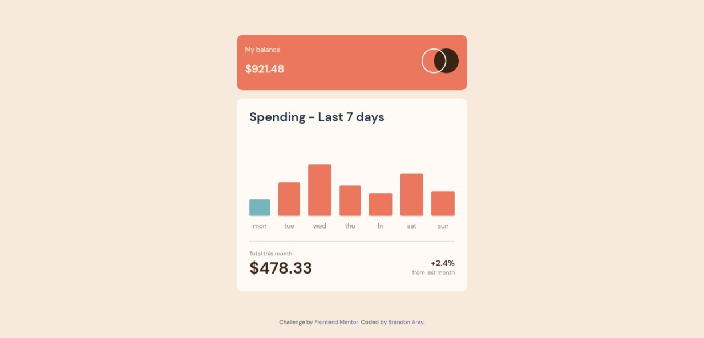

# Frontend Mentor - Expenses chart component solution

This is a solution to the [Expenses chart component challenge on Frontend Mentor](https://www.frontendmentor.io/challenges/expenses-chart-component-e7yJBUdjwt). Frontend Mentor challenges help you improve your coding skills by building realistic projects.

## Table of contents

- [Overview](#overview)
  - [The challenge](#the-challenge)
  - [Screenshot](#screenshot)
  - [Links](#links)
- [My process](#my-process)
  - [Built with](#built-with)
  - [What I learned](#what-i-learned)
  - [Continued development](#continued-development)
- [Author](#author)

## Overview

### The challenge

Users should be able to:

- View the bar chart and hover over the individual bars to see the correct amounts for each day
- See the current day’s bar highlighted in a different colour to the other bars
- View the optimal layout for the content depending on their device’s screen size
- See hover states for all interactive elements on the page
- **Bonus**: Use the JSON data file provided to dynamically size the bars on the chart

### Screenshot

### Links

- Solution URL: [https://github.com/branalex94/expenses-chart-component](https://github.com/branalex94/expenses-chart-component)
- Live Site URL: [https://branalex94.github.io/expenses-chart-component/](https://branalex94.github.io/expenses-chart-component/)

## My process

### Built with

- Semantic HTML5 markup
- CSS custom properties
- Flexbox
- CSS Grid
- Mobile-first workflow
- [React](https://reactjs.org/) - JS library
- [Vite.js](https://vitejs.dev/) - JavaScript Bundler
- [SASS](https://sass-lang.com//) - For styles

### What I learned

I learned how to do a basic implementation of the SASS css preprocessor, as well as dynamically provide data to show statistic graphics.

### Continued development

I plan on learning how to better use SASS as well a better ways to display information on screen with a more smooth and readable way.

## Author

- Frontend Mentor - [@yourusername](https://www.frontendmentor.io/profile/branalex94)
- GitHub - [@branalex94](https://www.github.com/branalex94)
